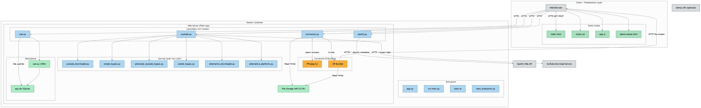
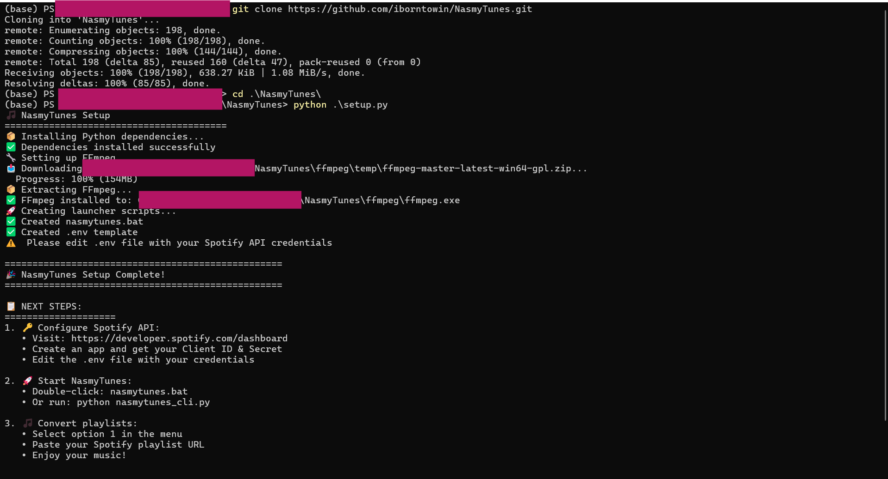
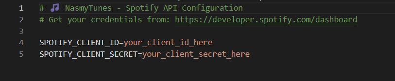
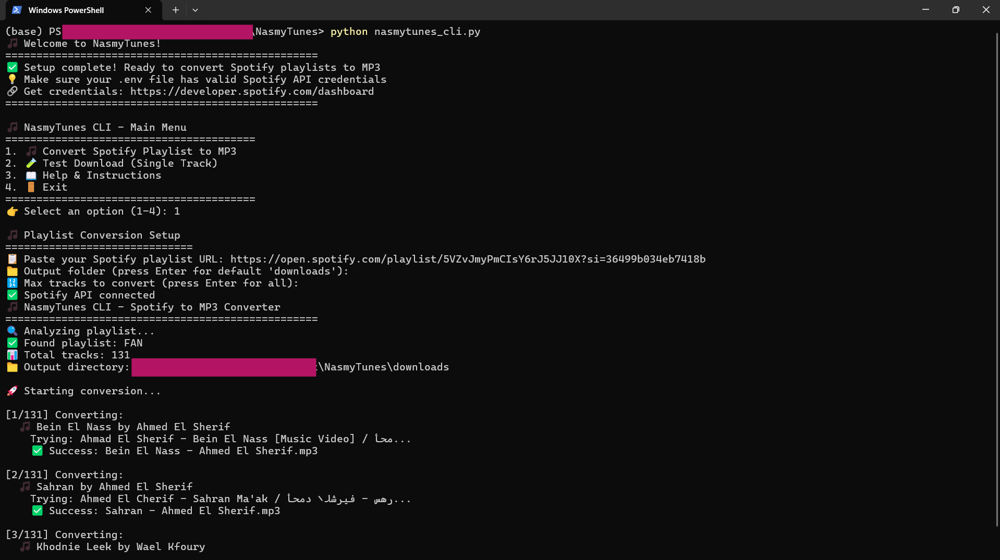
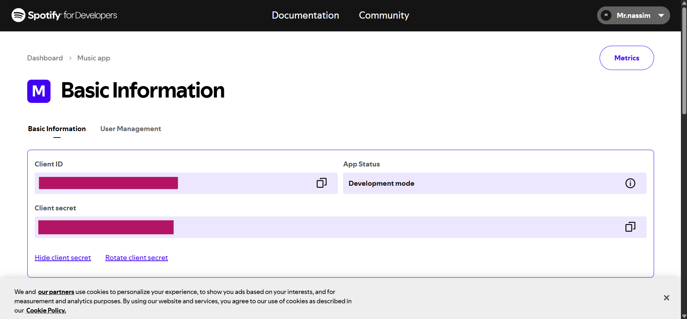

# 🎵 NasmyTunes - Spotify to MP3 Converter

Convert your Spotify playlists to high-quality MP3 files with an easy-to-use CLI interface.

## 🚀 Super Quick Start

```bash
git clone https://github.com/iborntowin/NasmyTunes.git
cd NasmyTunes
python setup.py
# Edit .env with your Spotify API credentials
python nasmytunes_cli.py  # Or double-click nasmytunes.bat on Windows
```

That's it! Just paste your playlist URL and enjoy your music! 🎵

## 📋 Table of Contents

- [🏗️ System Architecture](#️-system-architecture)
- [🎵 Live Demo](#-live-demo)
- [⚡ Quick Start](#-quick-start)
- [🔑 Spotify API Setup Guide](#-spotify-api-setup-guide)
- [📁 Project Structure](#-project-structure)
- [🚀 Free Deployment Options](#-free-deployment-options)
- [🤖 Advanced Bypass Techniques](#-advanced-bypass-techniques)
- [🛠️ Features](#️-features)
- [🔒 Security](#-security)
- [⚖️ Legal](#️-legal)

## 🏗️ System Architecture



*Complete system architecture showing the flow from Spotify playlist analysis to MP3 conversion and download*

## 🎵 Live Demo

Want to see NasmyTunes in action? Try converting this curated playlist:

<div align="center">

[](https://open.spotify.com/playlist/5VZvJmyPmCIsY6rJ5JJ10X)

### 🎧 Featured Test Playlist
**Perfect for testing NasmyTunes - A carefully curated selection of tracks**

```
https://open.spotify.com/playlist/5VZvJmyPmCIsY6rJ5JJ10X
```

</div>

### 🚀 How to use this playlist:
1. **Copy** the playlist URL above
2. **Run** NasmyTunes CLI (`python nasmytunes_cli.py`)
3. **Select** option 1 (Convert Playlist)
4. **Paste** the URL and enjoy your MP3s! 🎶

## ⚡ Quick Start

### 🖥️ CLI Version (Recommended)

#### Step 1: Clone and Setup
```bash
git clone https://github.com/iborntowin/NasmyTunes.git
cd NasmyTunes
python setup.py  # Automatically installs everything!
```


*The setup script will automatically install all dependencies and FFmpeg*

#### Step 2: Configure Spotify API
Get your credentials from [Spotify Developer Dashboard](https://developer.spotify.com/dashboard) and edit your `.env` file:


*Edit the .env file with your Spotify API credentials*

#### Step 3: Start Converting!
```bash
# Windows - Double-click nasmytunes.bat
# Or run: python nasmytunes_cli.py

# Mac/Linux  
./nasmytunes.sh
```


*Select option 1, paste your playlist URL, and enjoy your music!*

## 🔑 Spotify API Setup Guide

### Step 1: Create Spotify App
1. Visit the [Spotify Developer Dashboard](https://developer.spotify.com/dashboard)
2. Log in with your Spotify account
3. Click "Create App"
4. Fill in the app details (name, description)
5. Accept the terms and create your app

### Step 2: Get Your Credentials


*Your Client ID and Client Secret will be displayed in your app dashboard*

### Step 3: Configure NasmyTunes
Edit your `.env` file with the credentials:


*Your .env file should look like this with your actual credentials*

```env
SPOTIFY_CLIENT_ID=your_client_id_here
SPOTIFY_CLIENT_SECRET=your_client_secret_here
```

### 📚 Useful Links
- [Spotify Web API Documentation](https://developer.spotify.com/documentation/web-api)
- [Developer Dashboard](https://developer.spotify.com/dashboard)
- [API Getting Started Guide](https://developer.spotify.com/documentation/web-api/tutorials/getting-started)

## 📁 Project Structure

```
NasmyTunes/
├── 📄 nasmytunes_cli.py      # Main CLI application
├── 🔧 setup.py              # Automatic setup script
├── 🦇 nasmytunes.bat         # Windows launcher
├── 🐧 nasmytunes.sh          # Mac/Linux launcher
├── 📋 requirements.txt       # Python dependencies
├── 📖 README.md              # This file
├── 📁 src/                   # Web application source
├── 📁 docs/                  # Documentation & guides
├── 📁 tests/                 # Test files
├── 📁 scripts/               # Build & deployment scripts
└── 📁 deployment/            # Platform configs (Render, Railway, etc.)
```

### 🌐 Web Version

1. **Manual setup:**
```bash
git clone <your-repo-url>
cd spotify-mp3-converter
pip install -r requirements.txt
```

2. **Install FFmpeg:**
   - Windows: `winget install ffmpeg`
   - macOS: `brew install ffmpeg`
   - Linux: `sudo apt install ffmpeg`

3. **Configure environment:**
```bash
cp .env.example .env
# Edit .env with your API keys
```

4. **Run locally:**
```bash
python src/main.py
```

## 🚀 Free Deployment Options

### Railway (Recommended)
- $5/month free credits
- Easy GitHub integration
- Automatic deployments

### Render
- 100% free tier
- 750 hours/month
- Simple setup

### Vercel
- Free with limitations
- Great for demos

## 🔒 Security

- Never commit `.env` files
- Use platform environment variables for deployment
- Regenerate API keys if accidentally exposed

## ⚖️ Legal

This tool is for **personal use only**. Respect copyright laws and platform terms of service.

## 🛠️ Features

- ✅ Spotify playlist analysis
- ✅ YouTube audio search & download
- ✅ High-quality MP3 conversion (192kbps)
- ✅ Batch processing with progress tracking
- ✅ ZIP file downloads
- ✅ Modern glassmorphism UI
- ✅ Mobile responsive

## 🌐 Live Demo

**🚀 Try it now:** [https://nasmytunes.onrender.com](https://nasmytunes.onrender.com)

### 📱 How to Use

1. **🎵 Paste Spotify playlist URL** (make sure it's public)
2. **👀 Preview tracks** and confirm selection  
3. **🚀 Start conversion** with real-time progress
4. **📦 Download ZIP** with converted files

## 🏗️ Technical Architecture

The diagram above shows our comprehensive system design featuring:

- **🎯 Multi-layer Bypass System**: Advanced techniques to handle YouTube's bot detection
- **🔄 Real-time Processing**: Live progress updates and status tracking
- **🛡️ Graceful Degradation**: Demo mode when cloud restrictions apply
- **📊 Professional UI**: Modern glassmorphism design with responsive layout

📚 **Documentation:**
- [Architecture Guide](docs/ARCHITECTURE.md) - Technical deep dive
- [Visual Guide](docs/VISUAL_GUIDE.md) - Diagram breakdown and UI/UX details

## 🤖 Advanced Bypass Techniques

Our system implements cutting-edge bypass methods:

- **🔐 Authentication Simulation**: Browser cookie management
- **📱 Multiple Client Types**: Android, Web, Embedded clients
- **🌐 Rate Limiting**: Human-like request patterns
- **🔄 Proxy Support**: IP rotation capabilities
- **🎯 Fallback Systems**: Graceful handling of failures

## 🎉 Why NasmyTunes?

- **✨ Works Locally**: Full MP3 downloads on your computer
- **🌐 Cloud Demo**: Professional demonstration on Render
- **🔧 Open Source**: Complete codebase available
- **📚 Educational**: Learn about API integration and bypass techniques
- **🎨 Modern Design**: Beautiful glassmorphism interface

Enjoy your music! 🎶