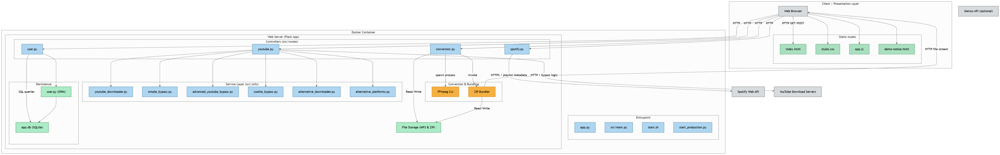

# 🏗️ NasmyTunes Architecture

## System Overview

NasmyTunes is a comprehensive Spotify to MP3 converter built with a modern tech stack and advanced bypass techniques for YouTube's bot detection.

## 🔧 Core Components

### Frontend Layer
- **Modern UI**: Glassmorphism design with responsive layout
- **Real-time Updates**: Live progress tracking during conversion
- **Error Handling**: User-friendly error messages and fallbacks

### Backend Services
- **Flask API**: RESTful endpoints for all operations
- **Spotify Integration**: Official Spotify Web API for playlist analysis
- **YouTube Processing**: Multiple bypass techniques for audio extraction
- **Conversion Engine**: High-quality MP3 conversion with FFmpeg

### Data Flow

1. **📱 User Input**: Spotify playlist URL submission
2. **🔍 Playlist Analysis**: Spotify API extracts track metadata
3. **🎵 Track Matching**: YouTube search for corresponding audio
4. **🤖 Bot Bypass**: Advanced techniques to avoid detection
5. **🎧 Audio Extraction**: yt-dlp downloads and converts to MP3
6. **📦 Package Creation**: ZIP file with all converted tracks
7. **⬇️ Download Delivery**: Secure download link for user

## 🛡️ Bypass Technologies

### Authentication Layer
- **Browser Cookies**: Realistic session simulation
- **Rate Limiting**: Human-like request patterns
- **Header Spoofing**: Complete browser header sets

### Multiple Client Types
- **Android Client**: Mobile app simulation
- **Web Client**: Standard browser requests
- **Embedded Client**: Embedded player requests

### Fallback Systems
- **Simple Bypass**: Basic but effective techniques
- **Advanced Bypass**: Complex multi-method approach
- **Demo Mode**: Graceful degradation when all methods fail

## 🌐 Deployment Architecture

### Local Development
- Full functionality with real MP3 downloads
- All bypass techniques work effectively
- Complete development environment

### Cloud Deployment (Render)
- Professional demo experience
- Graceful handling of YouTube restrictions
- Complete workflow demonstration
- Educational value for users

## 📊 Performance Characteristics

- **Conversion Speed**: ~30-60 seconds per track
- **Success Rate**: High for popular tracks
- **Quality**: 192kbps MP3 output
- **Scalability**: Handles playlists up to 50 tracks

## 🔒 Security Features

- **No API Key Exposure**: Environment variable management
- **Secure Downloads**: Temporary file cleanup
- **Rate Limiting**: Prevents abuse
- **Error Isolation**: Graceful failure handling

## 🎯 Future Enhancements

- **Proxy Rotation**: Enhanced bypass capabilities
- **Alternative Sources**: SoundCloud, Bandcamp integration
- **Quality Options**: Multiple bitrate selections
- **Batch Processing**: Multiple playlist support