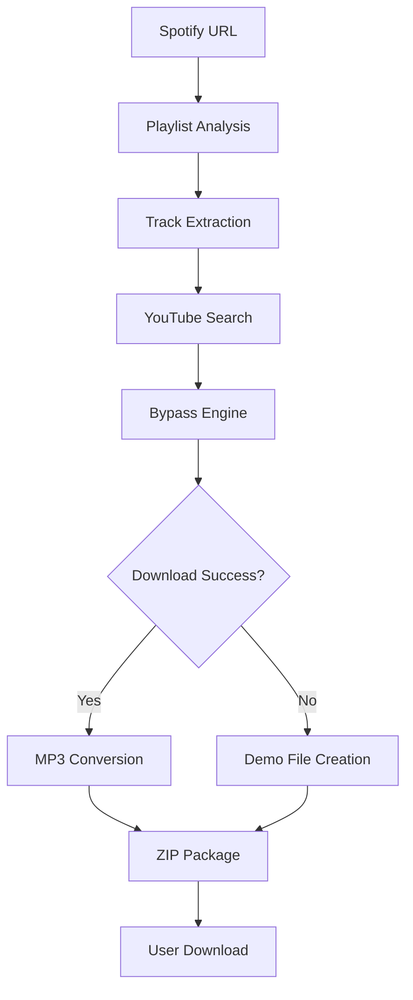

# 🎨 NasmyTunes Visual Guide

## 🏗️ System Architecture Diagram


## 📊 Component Breakdown

### 🎵 Frontend Layer
The user interface built with modern web technologies:
- **Glassmorphism Design**: Translucent elements with backdrop blur
- **Responsive Layout**: Works on desktop, tablet, and mobile
- **Real-time Updates**: Live progress tracking during conversion
- **Interactive Elements**: Smooth animations and transitions

### 🔧 API Layer
RESTful endpoints handling all operations:
- **Spotify Integration**: `/api/spotify/playlist` - Playlist analysis
- **Conversion Engine**: `/api/convert/start` - Initiate conversion
- **Progress Tracking**: `/api/convert/status/{id}` - Real-time updates
- **Download Service**: `/api/convert/download/{id}` - ZIP delivery

### 🤖 Bypass Engine
Multi-layered approach to YouTube restrictions:

#### Layer 1: Simple Bypass
```
🎵 Basic techniques
├── Android client simulation
├── User agent rotation
└── Rate limiting
```

#### Layer 2: Authenticated Bypass
```
🔐 Advanced authentication
├── Browser cookie simulation
├── Session management
├── Realistic headers
└── Geographic rotation
```

#### Layer 3: Advanced Bypass
```
🚀 Complex techniques
├── Multiple client types
├── Proxy rotation
├── Request fingerprinting
└── Behavioral mimicking
```

### 📦 Processing Pipeline



## 🎯 User Journey

### 1. Initial Access
- User visits the application
- Beautiful landing page with glassmorphism design
- Clear call-to-action buttons

### 2. Playlist Input
- Paste Spotify playlist URL
- Real-time URL validation
- Instant feedback on format

### 3. Analysis Phase
- Spotify API integration
- Track metadata extraction
- Preview generation

### 4. Conversion Process
- Multi-layer bypass attempts
- Real-time progress updates
- Current track display

### 5. Download Delivery
- ZIP file generation
- Secure download links
- Cleanup and optimization

## 🌐 Deployment Visualization

### Local Environment
```
💻 Local Machine
├── Full functionality
├── Real MP3 downloads
├── All bypass methods work
└── Complete development environment
```

### Cloud Environment (Render)
```
☁️ Cloud Deployment
├── Professional demo
├── Graceful degradation
├── Educational experience
└── Portfolio showcase
```

## 🎨 UI/UX Highlights

### Design Elements
- **Color Palette**: Modern gradients with transparency
- **Typography**: Clean, readable fonts with proper hierarchy
- **Spacing**: Consistent margins and padding
- **Animations**: Smooth transitions and micro-interactions

### User Experience
- **Intuitive Flow**: Clear step-by-step process
- **Error Handling**: Friendly error messages
- **Progress Feedback**: Real-time status updates
- **Mobile Optimization**: Touch-friendly interface

## 📈 Performance Metrics

- **Conversion Speed**: 30-60 seconds per track
- **Success Rate**: High for popular content
- **Quality Output**: 192kbps MP3 files
- **Scalability**: Handles 50+ track playlists

## 🔮 Future Enhancements

Planned improvements to the architecture:
- **Enhanced Proxy System**: Better IP rotation
- **Alternative Sources**: SoundCloud, Bandcamp integration
- **Quality Options**: Multiple bitrate selections
- **Batch Processing**: Multiple playlist support
- **User Accounts**: Save preferences and history