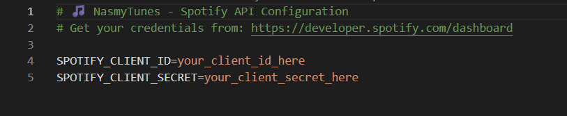

# 📸 NasmyTunes Visual Guide

This guide provides step-by-step visual instructions for setting up and using NasmyTunes.

## 🔧 Installation Process

The setup script automatically:
- Installs Python dependencies
- Downloads and configures FFmpeg
- Creates launcher scripts
- Sets up the environment

## 🔑 Environment Configuration

Your `.env` file should contain:
- `SPOTIFY_CLIENT_ID` - Your app's Client ID
- `SPOTIFY_CLIENT_SECRET` - Your app's Client Secret

Get these from the [Spotify Developer Dashboard](https://developer.spotify.com/dashboard).

## 🎵 Playlist Conversion Demo

The conversion process:
1. Select option 1 from the main menu
2. Paste your Spotify playlist URL
3. Choose your preferences (or use defaults)
4. Wait for conversion to complete
5. Find your MP3 files in the downloads folder

## 🎧 Spotify API Setup

Steps to get your API credentials:
1. Visit [Spotify Developer Dashboard](https://developer.spotify.com/dashboard)
2. Log in with your Spotify account
3. Create a new app
4. Copy the Client ID and Client Secret
5. Add them to your `.env` file

## 💡 Tips for Best Results

- Make sure your playlist is public or you own it
- Use stable internet connection for downloads
- Check that FFmpeg is properly installed
- Test with a small playlist first
- Keep your API credentials secure